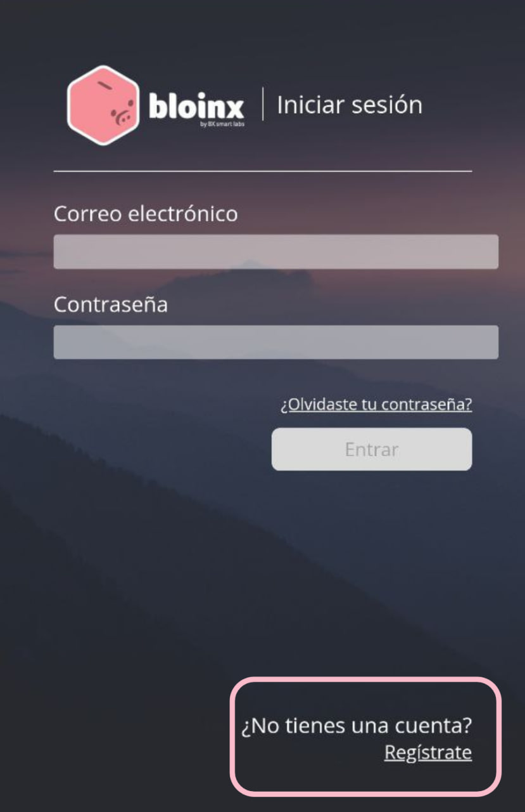

# Accede a la aplicación

Para poder acceder a la aplicación tendrás que usar el explorador de Metamask, así el sitio pueda conectarse con tu wallet.

Y coloca este url [https://bloinx.app/](https://bloinx.app/) aqui:.

.png>).png>)

Regístrate e inicia sesión.

<figure><figcaption></figcaption></figure>

Para iniciar da click en conecta tu wallet, elige la red con la que quieres acceder a Bloinx.

.png>).png>)

Si no tienes dada de alta la red, el sitio te preguntará si la quieres agregar.

Elije la wallet con la que quieras acceder a Bloinx.

.png>)

Si el botón rosa sigue diciendo “Conecta tu wallet” da click de nuevo. Sabrás que tu wallet está conectada correctamente cuando el botón se vea asi.

.png>)


