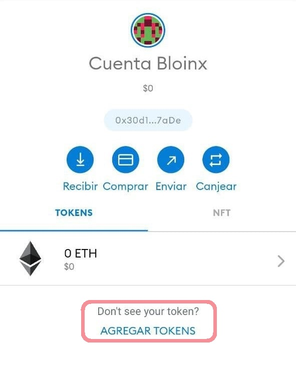

# Agrega fondos a tu wallet

Para poder participar en las rondas es necesario que cuentes con alguna de las siguientes "stable coins" dependiendo de la red en la que estes y token nativo para pagar por el costo de transacción:

| Red     | Stable Coin | Dirección de stable coin                   |
| ------- | ----------- | ------------------------------------------ |
| Celo    | cUSD        | 0x765DE816845861e75A25fCA122bb6898B8B1282a |
| Polygon | USDC        | 0x2791Bca1f2de4661ED88A30C99A7a9449Aa84174 |

Si estas usando Metamask debes agregar la dirección del token que usarás para poder ver tu saldo, el siguiente video muestra como hacerlo.



