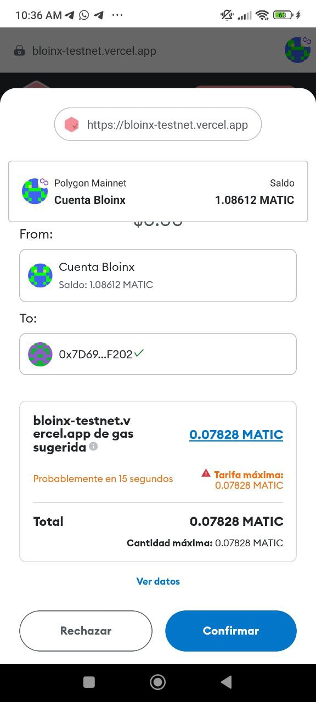

# Crea una ronda

Si estás organizando la ronda serás el encargado de crearla en Bloinx y al momento de crearla, te llamaremos de cariño “admin”.

Ya que hayas iniciado sesión y conectado tu wallet crea una nueva ronda dandole click a Crear Ronda.

<figure><figcaption></figcaption></figure>

Podrás elegir el número de participantes, el monto a pagar y la periodicidad. Verifica los datos y crea la ronda.

<figure><figcaption></figcaption></figure>

 

<figure><figcaption></figcaption></figure>

Al crear la ronda verás el siguiente cuadro de confirmación de tu wallet en el que se muestra el costo de creación de la ronda. Confirma la transacción.

<figure><figcaption></figcaption></figure>

Una vez creada la ronda podrás proceder a registrarte.


