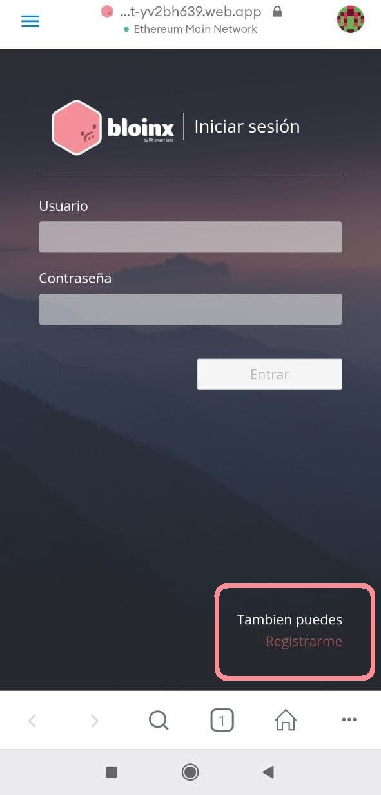

# Accede a la aplicación

Para poder acceder a la aplicación tendrás que usar el explorador de Metamask, así el sitio pueda conectarse con tu wallet.

Y coloca este url [https://beta-bloinx.web.app](https://beta-bloinx.web.app) aqui:.

.png>).png>)

Regístrate e inicia sesión.

Da click en conecta tu wallet. Verás un mensaje para cambiar a la red de Alfajores, aprueba y cámbiate de red.

Si el botón rosa sigue diciendo “Conecta tu wallet” da click de nuevo. Sabrás que tu wallet está conectada correctamente cuando el botón se vea asi.

.png>)
