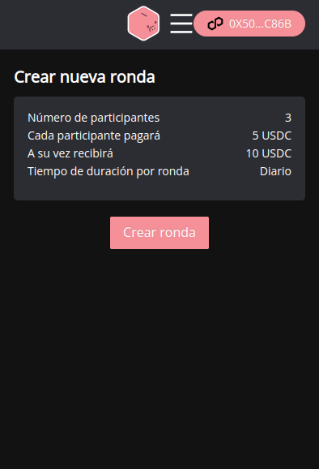

# Pagos y cobros

Una vez que inicio la ronda podras ver la informacion relevante en tu pantalla principal.

Los puntos representan los turnos, y para que siempre recuerdes el turno que elegiste lo podras ver con el el simbolo de "ud. esta aqui".

Cuando estes a tiempo en pagos el boton de "Pagar" cambiara a "Adelantar pago". Y cuando te toque cobrar se te activará el boton de "cobrar"

.png>)

